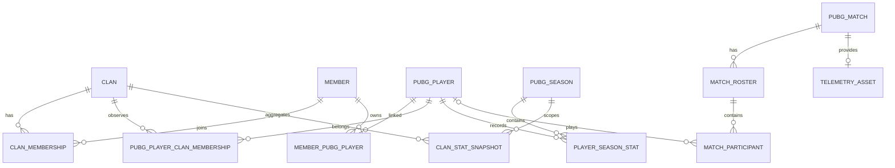

# BOBO 데이터 모델 초안

## 모델링 원칙

- 사람(`member`)과 PUBG 계정(`pubg_player`)을 분리한다. 한 사람이 여러 PUBG 계정을 가질 수 있다.
- 클랜 가입 이력을 별도 테이블로 보관한다. 탈퇴한 회원의 과거 경기 기록도 유지한다.
- PUBG API 원본과 화면용 집계 데이터를 분리한다.
- 자주 표시하는 경기 수치는 컬럼으로 저장하고, 아직 사용하지 않는 원본 필드는 `jsonb`로 보존한다.
- 텔레메트리 전체 이벤트는 처음부터 DB에 적재하지 않는다. 필요한 이벤트만 추출하거나 압축 파일로 외부 저장한다.

## 관계

## 서비스 도메인

### `clan`

홈페이지가 당장은 단일 클랜 전용이어도 클랜 정보를 설정값이 아닌 데이터로 둔다.

| 컬럼 | 타입 | 설명 |
| --- | --- | --- |
| `id` | `uuid` | 내부 식별자 |
| `pubg_clan_id` | `text`, unique, nullable | PUBG API 클랜 ID |
| `name` | `text` | 표시 이름 |
| `tag` | `text` | 클랜 태그 |
| `description` | `text`, nullable | 소개 |
| `created_at` | `timestamptz` | 생성 시각 |
| `updated_at` | `timestamptz` | 수정 시각 |

### `member`

사이트에서 관리하는 실제 사람이다. Discord 로그인을 사용한다면 별도 비밀번호는 저장하지 않는다.

| 컬럼 | 타입 | 설명 |
| --- | --- | --- |
| `id` | `uuid` | 내부 식별자 |
| `discord_user_id` | `text`, unique, nullable | Discord snowflake ID |
| `display_name` | `text` | 홈페이지 표시 이름 |
| `avatar_url` | `text`, nullable | 프로필 이미지 |
| `site_role` | `text` | `ADMIN`, `MANAGER`, `MEMBER` |
| `created_at` | `timestamptz` | 생성 시각 |
| `updated_at` | `timestamptz` | 수정 시각 |

### `clan_membership`

`member`가 클랜에 소속된 기간과 역할을 기록한다.

| 컬럼 | 타입 | 설명 |
| --- | --- | --- |
| `id` | `uuid` | 내부 식별자 |
| `clan_id` | `uuid`, FK | 클랜 |
| `member_id` | `uuid`, FK | 회원 |
| `clan_role` | `text` | `MASTER`, `MANAGER`, `MEMBER` |
| `status` | `text` | `ACTIVE`, `INACTIVE`, `LEFT` |
| `joined_at` | `timestamptz` | 가입 시각 |
| `left_at` | `timestamptz`, nullable | 탈퇴 시각 |

활성 가입 건에 대해서는 `(clan_id, member_id)`가 중복되지 않게 부분 unique index를 둔다.

## PUBG 계정 및 시즌

### `pubg_player`

PUBG API가 반환하는 게임 계정이다. 닉네임은 바뀔 수 있으므로 API의 account ID를 영구 식별자로 사용한다.

| 컬럼 | 타입 | 설명 |
| --- | --- | --- |
| `id` | `uuid` | 내부 식별자 |
| `pubg_account_id` | `text`, unique | PUBG account ID |
| `shard` | `text` | 예: `kakao`, `steam` |
| `current_name` | `text` | 현재 인게임 닉네임 |
| `last_synced_at` | `timestamptz`, nullable | 마지막 동기화 |
| `created_at` | `timestamptz` | 생성 시각 |
| `updated_at` | `timestamptz` | 수정 시각 |

### `pubg_player_clan_membership`

PUBG API의 `clanId`로 확인한 게임 계정의 클랜 소속 이력이다. API에서 발견한 계정을 곧바로 홈페이지의 실제 사람(`member`)으로 만들지 않고 이 테이블에 먼저 기록한다.

| 컬럼 | 타입 | 설명 |
| --- | --- | --- |
| `id` | `uuid` | 내부 식별자 |
| `clan_id` | `uuid`, FK | 내부 클랜 |
| `pubg_player_id` | `uuid`, FK | PUBG 계정 |
| `status` | `text` | `CANDIDATE`, `VERIFIED`, `LEFT` |
| `discovered_from_match_id` | `text`, FK, nullable | 처음 발견한 경기 |
| `first_seen_at` | `timestamptz` | 최초 발견 시각 |
| `last_verified_at` | `timestamptz`, nullable | API로 마지막 확인한 시각 |
| `left_detected_at` | `timestamptz`, nullable | 탈퇴를 감지한 시각 |

활성 상태인 `(clan_id, pubg_player_id)`에 부분 unique index를 둔다. 같은 팀에서 발견한 미확인 계정은 `CANDIDATE`, 플레이어 조회 결과의 `clanId`가 대상 클랜과 같으면 `VERIFIED`로 승격한다.

### `member_pubg_player`

사람과 PUBG 계정의 1:N 연결이다. 한 사람은 여러 계정을 가질 수 있지만 한 게임 계정을 여러 사람이 소유하지는 않는다.

| 컬럼 | 타입 | 설명 |
| --- | --- | --- |
| `member_id` | `uuid`, FK | 회원 |
| `pubg_player_id` | `uuid`, FK, unique | PUBG 계정 |
| `is_primary` | `boolean` | 대표 계정 여부 |
| `linked_at` | `timestamptz` | 연결 시각 |

기본 키는 `(member_id, pubg_player_id)`로 둔다.

### `pubg_season`

| 컬럼 | 타입 | 설명 |
| --- | --- | --- |
| `id` | `text` | PUBG season ID |
| `is_current` | `boolean` | 현재 시즌 여부 |
| `is_offseason` | `boolean` | 오프시즌 여부 |
| `created_at` | `timestamptz` | 최초 수집 시각 |

### `player_season_stat`

플레이어별 시즌·게임 모드 집계다. 일반전과 경쟁전을 `queue_type`으로 구분한다.

| 컬럼 | 타입 | 설명 |
| --- | --- | --- |
| `pubg_player_id` | `uuid`, FK | PUBG 계정 |
| `season_id` | `text`, FK | 시즌 |
| `queue_type` | `text` | `NORMAL`, `RANKED` |
| `game_mode` | `text` | 예: `squad-fpp` |
| `rounds_played` | `integer` | 경기 수 |
| `wins` | `integer` | 승리 수 |
| `top_10s` | `integer` | TOP 10 횟수 |
| `kills` | `integer` | 킬 수 |
| `assists` | `integer` | 어시스트 수 |
| `damage_dealt` | `numeric` | 총 피해량 |
| `time_survived` | `numeric` | 총 생존 시간(초) |
| `raw_stats` | `jsonb` | API의 나머지 집계 필드 |
| `synced_at` | `timestamptz` | 동기화 시각 |

기본 키는 `(pubg_player_id, season_id, queue_type, game_mode)`로 둔다. K/D와 평균 피해량은 저장하지 않고 조회 시 계산해 값 불일치를 막는다.

## 경기

### `pubg_match`

| 컬럼 | 타입 | 설명 |
| --- | --- | --- |
| `id` | `text` | PUBG match ID |
| `shard` | `text` | 플랫폼 shard |
| `map_name` | `text` | 맵 코드 |
| `game_mode` | `text` | 게임 모드 |
| `match_type` | `text` | 공식전/커스텀 등 |
| `started_at` | `timestamptz` | 경기 시작 시각 |
| `duration_seconds` | `integer` | 경기 시간 |
| `raw_payload` | `jsonb`, nullable | match API 원본 |
| `collected_at` | `timestamptz` | 수집 시각 |

### `match_roster`

경기 안의 한 팀이다. API roster ID는 경기 범위에서만 의미가 있으므로 복합 키를 사용한다.

| 컬럼 | 타입 | 설명 |
| --- | --- | --- |
| `match_id` | `text`, FK | 경기 |
| `roster_id` | `text` | API roster ID |
| `team_id` | `integer`, nullable | 텔레메트리 팀 ID |
| `rank` | `integer` | 최종 순위 |
| `won` | `boolean` | 우승 여부 |

기본 키는 `(match_id, roster_id)`로 둔다.

### `match_participant`

경기 당시 닉네임과 주요 수치를 스냅샷으로 저장한다. 아직 등록하지 않은 상대 플레이어도 있으므로 `pubg_player_id`는 nullable이다.

| 컬럼 | 타입 | 설명 |
| --- | --- | --- |
| `id` | `text` | API participant ID |
| `match_id` | `text`, FK | 경기 |
| `roster_id` | `text` | 소속 roster |
| `pubg_player_id` | `uuid`, FK, nullable | 등록된 PUBG 계정 |
| `pubg_account_id` | `text`, nullable | 경기 당시 API account ID |
| `name_snapshot` | `text` | 경기 당시 닉네임 |
| `kills` | `integer` | 킬 |
| `assists` | `integer` | 어시스트 |
| `dbnos` | `integer` | 기절시킨 횟수 |
| `damage_dealt` | `numeric` | 피해량 |
| `headshot_kills` | `integer` | 헤드샷 킬 |
| `revives` | `integer` | 부활 |
| `time_survived` | `numeric` | 생존 시간(초) |
| `stats` | `jsonb` | 그 외 participant stats |

`(match_id, roster_id)`는 `match_roster`를 참조한다. participant의 `pubg_player_id`와 match의 `started_at` 조회 경로에 인덱스를 둔다.

## 텔레메트리와 수집

### `telemetry_asset`

| 컬럼 | 타입 | 설명 |
| --- | --- | --- |
| `match_id` | `text`, PK/FK | 경기 |
| `source_url` | `text` | PUBG CDN URL |
| `storage_key` | `text`, nullable | 압축 원본을 별도 저장한 위치 |
| `status` | `text` | `PENDING`, `STORED`, `PARSED`, `FAILED` |
| `event_count` | `integer`, nullable | 파싱한 이벤트 수 |
| `processed_at` | `timestamptz`, nullable | 처리 시각 |

초기 버전에서는 URL만 저장한다. 킬 로그나 무기 통계를 실제 화면에서 요구할 때 `kill_event` 같은 파생 테이블을 추가한다.

### `sync_job`

폰 여러 대를 worker로 사용할 가능성까지 고려한 작업 큐다.

| 컬럼 | 타입 | 설명 |
| --- | --- | --- |
| `id` | `uuid` | 작업 ID |
| `job_type` | `text` | `SYNC_PLAYER`, `SYNC_SEASON`, `FETCH_MATCH`, `PARSE_TELEMETRY` |
| `target_key` | `text` | player/match 등 대상 ID |
| `payload` | `jsonb` | 작업 옵션 |
| `status` | `text` | `PENDING`, `RUNNING`, `SUCCEEDED`, `FAILED` |
| `priority` | `integer` | 우선순위 |
| `attempt_count` | `integer` | 시도 횟수 |
| `available_at` | `timestamptz` | 실행 가능 시각 |
| `locked_by` | `text`, nullable | 처리 중인 worker |
| `locked_at` | `timestamptz`, nullable | 점유 시각 |
| `last_error` | `text`, nullable | 마지막 오류 |
| `created_at` | `timestamptz` | 생성 시각 |
| `finished_at` | `timestamptz`, nullable | 완료 시각 |

worker는 `FOR UPDATE SKIP LOCKED`로 `PENDING` 작업을 하나씩 점유할 수 있다.

## 화면용 집계

### `clan_stat_snapshot`

메인 페이지를 매 요청마다 무거운 조인으로 계산하지 않기 위한 캐시성 테이블이다. 원본 데이터가 아니라 언제든 재생성할 수 있는 파생 데이터다.

| 컬럼 | 타입 | 설명 |
| --- | --- | --- |
| `id` | `uuid` | 식별자 |
| `clan_id` | `uuid`, FK | 클랜 |
| `season_id` | `text`, FK | 시즌 |
| `queue_type` | `text` | 일반/경쟁 |
| `game_mode` | `text` | 게임 모드 |
| `active_member_count` | `integer` | 활성 인원 |
| `matches` | `integer` | 경기 수 |
| `wins` | `integer` | 우승 수 |
| `kills` | `integer` | 총 킬 |
| `deaths` | `integer` | 총 데스 |
| `damage_dealt` | `numeric` | 총 피해량 |
| `top_10s` | `integer` | TOP 10 횟수 |
| `calculated_at` | `timestamptz` | 계산 시각 |

메인 화면의 K/D, 평균 피해량, TOP 10 비율은 이 합계로 계산한다.

## 초기 구현 범위

1. `clan`, `member`, `clan_membership`
2. `pubg_player`, `member_pubg_player`
3. `pubg_player_clan_membership`
4. `pubg_season`, `player_season_stat`
5. `pubg_match`, `match_roster`, `match_participant`
6. `sync_job`

`telemetry_asset`과 `clan_stat_snapshot`은 실제 수집 흐름과 메인 조회 쿼리를 만든 뒤 추가해도 된다.

PUBG API는 플레이어 응답에서 최근 match ID를 제공하고, match ID로 경기와 텔레메트리 URL을 조회하는 흐름이다. 공식 문서상 경기 데이터의 제공 기간이 제한되므로, 필요한 경기 기록은 발견 즉시 내부 DB에 저장한다.
